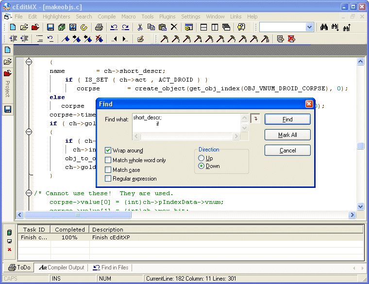



## cEditXP \(Version 4\.9\.9\)

### Description

cEditXP is a new release of the VB cEdit 4 series. It is to a large extent totally rewritten. It now utilizes the ScintillaVB control to provide extensive support for code highlighting including folding, code sense and auto complete.

This application uses RvMDITab, VB6VBATabControl, and SCIVB. I've included the source code for all 3. The credit's are included in the about box. For notes worth the VB6VBATabControl is written by Steve from VBAccelerator. The REVMDITabs is written by Andrea Batina and is available here. Both have some very minor modifications to correct problems interacting with eachother.

You can download a copy from my website at http://www.ceditmx.com/cx.zip if you wish to have the controls precompiled.

I welcome comments and suggestions and constructive critisism. Thank you and enjoy.
 
### More Info
 

             |
---                |---
**Submitted On**   |2006-04-22 09:03:44
**By**             |[Stewart](https://github.com/Planet-Source-Code/PSCIndex/blob/master/ByAuthor/stewart.md)
**Level**          |Intermediate
**User Rating**    |5.0 (85 globes from 17 users)
**Compatibility**  |VB 6\.0
**Category**       |[Complete Applications](https://github.com/Planet-Source-Code/PSCIndex/blob/master/ByCategory/complete-applications__1-27.md)
**World**          |[Visual Basic](https://github.com/Planet-Source-Code/PSCIndex/blob/master/ByWorld/visual-basic.md)
**Archive File**   |[cEditXP\_\(V201163862006\.zip](https://github.com/Planet-Source-Code/stewart-ceditxp-version-4-9-9__1-66207/archive/master.zip)

